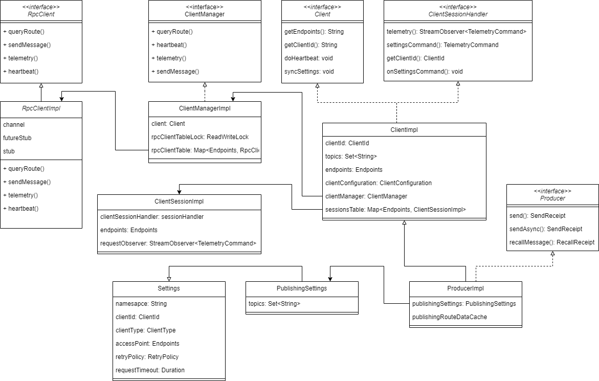

# 前言

RocketMQ 5.x之后服务端与客户端通信采用GRPC协议，Remoting协议仅用于服务端组件之间的内部通信。由此RocketMQ 5.x基于GRPC协议重写了客户端，本篇介绍5.x版Java客户端设计与实现。

# GRPC

简单介绍下GRPC，它是Google开源的RPC协议，RPC大家都知道是remote process call远程过程调用，允许客户端像在本地一样地调用远端服务器提供的服务，这其中涉及两点：
- 序列化：客户端与服务端之间传递数据对发送内容的序列化、反序列化；GRPC采用Google自研开源的protocol buffer数据序列化协议，具备更高效的性能与更小的序列化数据体积
- 协议：客户端与服务端之间通过怎样的规则交互；GRPC协议基于HTTP2协议设计实现，除了支持一问一答的一元交互，还利用HTTP2帧传导支持单向、双向流式调用，大大降低了延迟、提高了吞吐量。

# 代码仓

5.x客户端不再维护在rocketmq仓库中，而是包含在两个独立代码仓：
- rocketmq-apis：GRPC服务定义，编写语言无关的.proto文件，可通过protocol buffer编译成各种语言实现的统一标准服务API定义；以java为例会生成maven坐标为org.apache.rocketmq:rocketmq-proto的jar包，提供了系统涉及的所有的Service定义、请求响应体定义。
- rocketmq-clients：客户端主体代码实现，提供各种语言实现的客户端。

# 关键类



生产者从顶向下涉及以下实现类：
- ProducerImpl：它实现Producer接口，提供生产者视角下特定操作，管理生产者生命周期。
- ClientImpl：它实现Client接口，提供客户端视角下通用操作，管理客户端生命周期，维护客户端ID、接入点信息、Topic路由信息、客户端会话状态、接入点联通状态等客户端状态。
- ClientManagerImpl：它实现ClientManager接口，提供查询路由、上报心跳、推送遥测数据等单接入点请求级API实现，同时维护着rpcClient列表、异步任务线程池、延迟任务线程池；它与ClientImpl是一对一相互持有关系，
- RpcClientImpl：它实现RpcClient接口，提供RPC层面命令实现，通过GRPC存根与GRPC框架完成通信。

# 初始化
5.x所有客户端初始化都由ClientServiceProvider启动：
- ClientServiceProvider提供接口创建ProducerBuilder，再由ProducerBuilder构造Producer。
- ClientServiceProvider可通过Java SPI机制加载第三方实现，创建自定义ProducerBuilder。

PorucerBuilder涉及4个字段：
- clientConfiguration：客户端基本配置：
    - endpoints：接入点
    - requestTimeout：请求超时时长
    - sslEnabled：是否开启ssl
    - namespace：命名空间
    - sessionCredentialsProvider：会话认证
- topics: 涉及哪些topic。
- maxAttempts：发送失败时最大重试次数。
- checker：事务消息相关。

ProducerImpl构造过程：
- ProducerBuilderImpl.build：
    - new ProducerImpl：创建生产者。
    - ProducerImpl.startAsync：启动生产者。

# 路由查询

生产者启动过程中会首先查询所有Topic路由信息，后续默认每30秒以Topic为单位查询并更新路由信息，客户端调用过程如下：
ClientImpl.updateRouteCache：
- ClientImpl.fetchTopicRoute：
    - ClientImpl.fetchTopicRoute0：
        - ClientManagerImpl.queryRoute：
            - RpcClientImpl.queryRoute：最终返回目标Topic下所有队列信息。


取回队列信息后客户端经过一系列数据结构转换，得到如下示例数据：
```json
{
	"topicRouteData": {
		"index": 1,
		"messageQueueImpls": [
			{
				"queueId": 0,
				"broker": {
					"id": 0,
					"name": "broker-0",
					"endpoints": {
						"address": {
							"host": "127.0.0.1",
							"port": 8081
						}
					}
				}
			}
		]
	}
}
```

值得注意的是其中broker.endpoints.address其实并非Broker节点地址，而是处理此次路由查询请求的Proxy节点地址，Broker节点的真实地址在Proxy处理请求的过程中被主动替换掉隐藏了。

# Settings

5.x以前客户端通过主动向服务端发送心跳包用来保活，除此以外心跳包同时用来上报消费组订阅关系、客户端关键配置信息，这导致心跳包变得很重。

5.x引入Settings承担了客户端服务端同步信息的职责，并且支持客户端服务端双向同步，降低心跳包职责复杂度的同时提高了客户端服务端之间同步信息的灵活度。

对于生产者，Settings类型为PublishingSettings，内容包括：
- maxBodySize：最大消息大小，一般在服务端设置。
- topics：涉及哪些Topic。
- validateMessageType：是否校验消息类型。
- maxAttempts：发送失败时最大尝试次数。

# 发送消息

## Client处理
ProducerImpl.send：
- 检查Producer是否running
- 构造PublishingMessageImpl
- 检查消息类型是否一致
- 如果是FIFO消息检查MessageGroup是否一致
- ProducerImpl.takeMessageQueues：
    - PublishingLoadBalancer.takeMessageQueues：选取所有未隔离的队列
- ProducerImpl.send0：挑选最终唯一队列，校验队列支持的消息类型
    - ProducerImpl.doBefore：
    - ProducerImpl.send0：
        - ProducerImpl.wrapSendMessageRequest：
            - ClientManager.sendMessage：
                - RpcClientImpl.sendMessage：最终发送想消息
        - ProducerImpl.doAfter：

## Proxy处理
GrpcMessagingApplication.sendMessage：
- DefaultGrpcMessagingActivity.sendMessage：
    - SendMessageActivity.sendMessage：
        - SendMessageActivity.validateTopic：
        - MessagingProcessor.sendMessage：
            - ProducerProcessor.sendMessage：
                - SendMessageQueueSelector.select：简单说就是根据规避策略过滤出所有Broker的所有可用队列，再按Broker下标、队列下标顺序轮询。
                - ProducerProcessor.buildSendMessageRequestHeader：
                - ClusterMessageService.sendMessage：
                    - MQClientAPIExt.sendMessageAsync：
                        - RemotingClient.invoke：走remote协议发送请求至Broker
            - TopicRouteService.updateFaultItem：标记失败、高延迟的队列用于后续规避。
        - SendMessageActivity.convertToSendMessageResponse：封装响应体。

# 高可用

Proxy发送消息到Broker的高可用设计：
过滤条件：
- 可用：每个Broker会标记可用时间点，在当前时间到达这个时间点之前Broker为不可用。
- 可达：只要发送Broker过程中抛出异常即标记为不可达。

过滤策略：
- 默认需要可用、可达两种条件一起过滤通过
- 两种条件一起选不出Broker时，只要可用就通过
- 没有可用Broker时，只要可达就通过
- 如果怎么过滤都选不出来，按Broker下标轮询，能不能行看命了

刷新可用：每次发送完成后都会刷新Broker可用时间点，时间点=当前时间 + 本次发送的时延，也就是如果现在时延比较高就先歇着。

刷新可达：默认会开启定时探测Broker是否可达刷新可达标记，否则Broker一旦被标记就永世不得翻身了。

# 总结
1. 其实客户端针对Broker、队列的选择是多余的，因为最后反正也是Proxy挑Broker、队列。
2. Proxy到Broker的高可用通过故障规避，客户端到Proxy的高可用通过GRPC框架轮询多个endpoint。
3. 有些功能设计感觉还没用起来，比如onlybroker没见过true一直是false，可能是阉割了部分功能但这块代码又不能全删掉。。