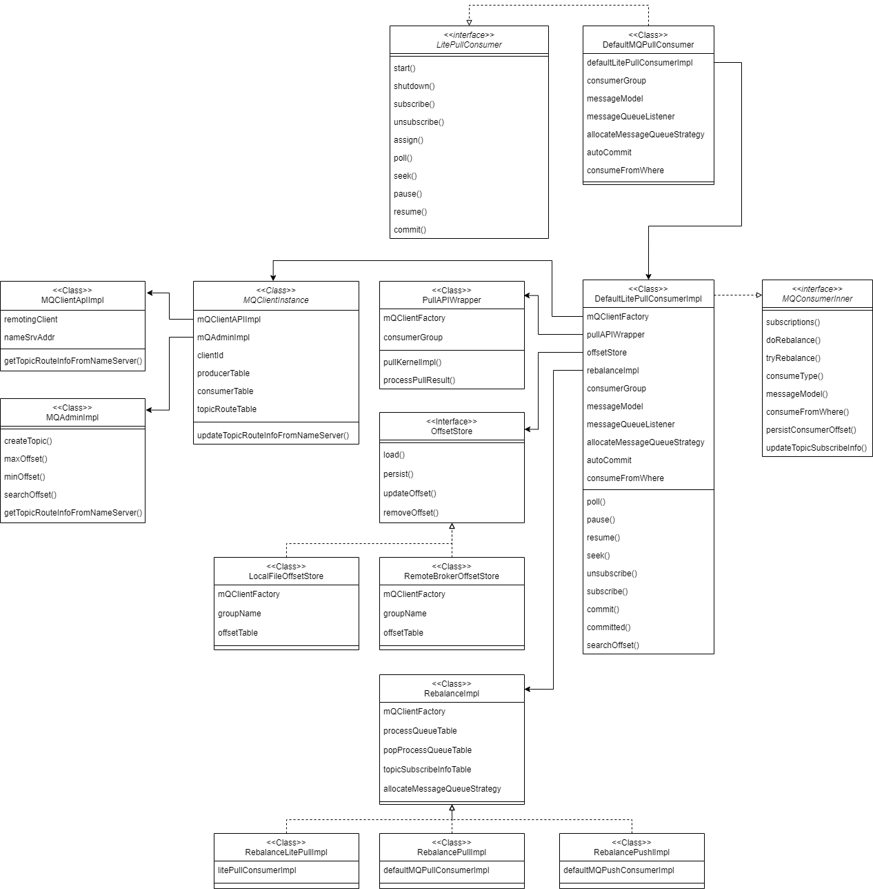
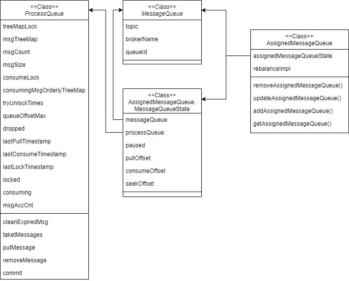

# 前言

本篇总结 4.x 版本LitePull集群消费者Assign模式、Subscribe模式从Broker拉取并消费一条Remoting协议消息的过程。

# Client

## 相关类继承体系

## MessageQueue继承体系

## 消费者启动

DefaultLitePullConsumer.start：

- DefaultLitePullConsumer.setTraceDispatcher：
- DefaultLitePullConsumer.setConsumerGroup：
- DefaultLitePullConsumerImpl.start：
  - DefaultLitePullConsumerImpl.checkConfig：校验配置是否合法。
  - DefaultLitePullConsumerImpl.initMQClientFactory：创建或获取MQClientInstance单例实例。
  - DefaultLitePullConsumerImpl.initRebalanceImpl：初始化RebalanceImpl。
  - DefaultLitePullConsumerImpl.initPullAPIWrapper：初始化PullAPIWrapper。
  - DefaultLitePullConsumerImpl.initOffsetStore：初始化OffsetStore。
  - MQClientInstance.start：
    - MQClientAPIImpl.start：
      - RemotingClient.start：启动RemotingClient。
    - MQClientInstance.startScheduledTask：启动调整线程池、持久化消费offset、发送心跳、清理离线Broker、刷新路由信息、刷新namesrv地址等定时任务。
    - PullMessageService.start：启动消息拉取服务，用于消费场景。
    - RebalanceService.start：启动重平衡服务，用于消费场景。
    - DefaultMQProducerImpl.start：启动CLIENT_INNER_PRODUCER_GROUP生产者组的内部默认生产者，用于消息回发等场景。
  - DefaultLitePullConsumerImpl.startScheduleTask：定时拉取Topic队列分布信息。
  - DefaultLitePullConsumerImpl.operateAfterRunning：
    - SUBSCRIBE模式立即更新订阅关系；ASSIGN模式下立即启动拉取消息的线程；
    - 更新Topic队列分布信息；
    - 遍历所有Broker检查订阅关系过滤条件是否一致。
- TraceDispatcher.start：启动消息轨迹服务，如果开启消息轨迹。

## ASSIGN

ASSIGN模式下多个消费者之间不会自动重平衡，需要客户端主动分配指定队列，自行维护订阅关系。

#### Poll

Consumer poll方法不会直接从Broker拉取消息，而是从本地缓存中拉取，缓存中的消息由另外的线程定时从Broker拉取。

- DefaultLitePullConsumerImpl.fetchTopicMessageQueuesAndCompare：定时从Broker拉取Topic队列信息并更新本地缓存。
- DefaultLitePullConsumer.poll：
  - DefaultLitePullConsumerImpl.poll：
    - DefaultLitePullConsumerImpl.checkServiceState：检查Consumer服务状态是否为RUNNING。
    - BlockingQueue<ConsumeRequest> consumeRequestCache.poll：从已拉取并缓存在本地的Cache中拉取待消费消息。

#### Pull

真正拉取消息的动作由PullTaskImpl.run触发，每个队列对应一个PullTaskImpl对象，所有PullTaskImpl交由定时线程池执行：

- AssignedMessageQueue.getProcessQueue：获取目标队列对应的ProcessQueue
- 如果ProcessQueue缓存的消息量、消息大小、消息步长达到Consumer阈值，Consumer触发流控，默认延迟50ms后再拉取。
- DefaultLitePullConsumerImpl.nextPullOffset：
  - 如队列有设置seekOffset则取之。
  - 如未设置seekOffset，则取pullOffset。
  - 如未设置pullOffset，则根据拉取策略重新计算Offset。
- DefaultLitePullConsumerImpl.pullSyncImpl：
  - PullAPIWrapper.pullKernelImpl：
    - MQClientInstance.updateTopicRouteInfoFromNameServer：更新topic路由信息。
    - MQClientAPIImpl.pullMessage：设置RequestCode。
    - MQClientAPIImpl.pullMessageSync：调用RemotingClient同步方法拉取消息。
    - MQClientAPIImpl.processPullResponse：解析Response返回PullResult。
  - PullAPIWrapper.processPullResult：执行hook，将二进制消息解码转换成MessageExt并再次过滤后返回。
- ProcessQueue.putMessage：将拉取的消息填入ProcessQueue。
- DefaultLitePullConsumerImpl.submitConsumeRequest：向ConsumeRequestCache新增ConsumeRequest。
- DefaultLitePullConsumerImpl.updatePullOffset：更新下次开始拉取的offset。

## SUBSCRIBE

SUBSCRIBE模式下多个消费者间会自动重平衡，订阅关系由RebalanceService维护。

#### Rebalance

- RebalanceService.run：
- MQClientInstance.doRebalance：
  - DefaultLitePullConsumerImpl.tryRebalance：
  - RebalanceImpl.doRebalance：
  - RebalanceImpl.rebalanceByTopic：
    - BROADCASTING：
      - RebalanceImpl.updateProcessQueueTableInRebalance：取订阅关系中的所有队列，ProcessQueueTable新增新队列，移除不再关注的队列。
      - RebalanceImpl.messageQueueChanged：队列变化时调用预置钩子函数。
    - CLUSTERING：
      - MQClientInstance.findConsumerIdList：
      - AllocateMessageQueueStrategy.allocate：根据指定策略算法，重新分配队列。
      - RebalanceImpl.updateProcessQueueTableInRebalance：根据重平衡结果，ProcessQueueTable新增新队列，移除不再关注的队列。

#### Pull

与ASSIGN模式下Pull相同，由PullTaskImpl.run触发，将消息拉取到ProcessQueue的cache中，由Consumer poll最终拉取。
