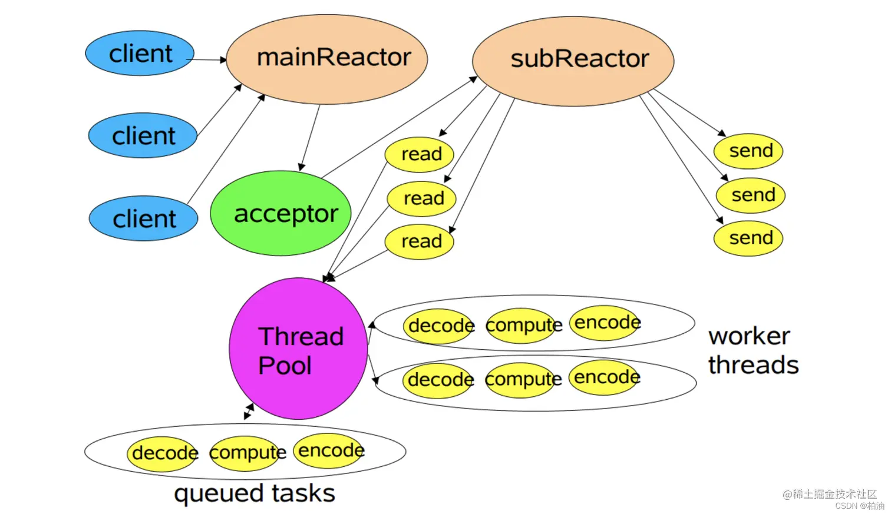

# 前言

Remoting是RocketMQ基于Netty自研实现的网络通信协议。作为RocketMQ根技术之一，Remoting协议在5.x之前是用于包括客户端/服务端之间、集群内部节点之间在内的全域通信协议，而在5.x之后客户端/服务端之间默认采用GRPC协议通信，Remoting协议仅用于集群内部节点之间的通信。

本篇大致介绍Remoting模块的设计与实现，以一个client与broker之间心跳的实际请求响应场景解析该模块的核心流程。

# Netty

这里摘抄一段Netty的概括介绍：Netty的主要作用是为开发人员提供一个高效、可靠和可扩展的网络通信框架，从而降低网络应用程序的开发难度和维护成本。它提供了一系列的编解码器、处理器和协议支持，使得开发人员可以更加专注于业务逻辑的实现，而不必关心底层网络通信细节。

Netty采用Reactor线程模型：

简单说下3个线程池的职责：
- mainReactor：负责监听服务端启动指定的端口号，处理客户端请求新建网络连接而产生的Accept事件，初始化Channel并注册到Selector。
- subReactor：负责处理Selector监听到的各种IO事件、从socket中读写数据，完成执行最终业务逻辑前后的所有工作。
- worker threads：负责处理网络协议编解码、业务操作等特定具体的业务逻辑。

Netty涉及的主要组件包括：
- Channel：框架针对网络连接的抽象，所有数据通过Channel从网络一端发送至另一端。
- Selector：Channel的IO事件监听器，将Channel注册到Selector后，Selector将负责监听该Channel产生的所有bind、accept、write、read IO事件。
- EventLoop：框架针对每个IO事件处理全流程的抽象，简称“事件循环”；它可以理解为一个无限循环的线程，持有一个Selector持续不停地监听、处理已注册所有Channel产生的所有IO事件。
- EventLoopGroup：它以组为单位统一管理一批EventLoop，可以理解为一个线程池，其中的每个线程都是一个EventLoop。
- ChannelHandler：Channel的IO事件处理器，是处理事件的最小单元。每个Handler将被注册到唯一一个ChannelPipeline中，每轮触发将在特定ChannelHandlerContext下按照事先规划的顺序处理不同事件。
- ChannelHandlerContext：保存Channel相关上下文信息，同时关联一个ChannelHandler对象。
- ChannelPipeline：以双向链表的形式管理注册到其中的ChannelHandler。这些Handler分为入站handler、出站handler，每轮处理分别在入站、出站两个方向上按从头到尾的顺序触发已注册的handler。Netty采用先入后出、读入写出的设计，即在每轮处理中先处理入站流量再处理出站流量，入站方向默认处理读事件、出站默认处理写事件。
- Boostrap：用于配置整个Netty程序，通过链式调用串联各个组件。

# 协议

Remoting协议主要分如上图四个部分：
- 消息长度：采用4个字节int类型存储传输内容的总长度。
- 序列化类型 & 消息头长度：采用4个字节int类型，第1个字节表示序列化类型，后3个字节表示消息头长度。
- 消息头数据：序列化后的消息头。
- 消息主体数据：消息主体的二进制数据内容。

# 继承关系

关键实现类如下：
- NettyRemotingServer：remoting协议服务端，用于向外部模块提供服务。
- NettyRemotingClient：remoting协议客户端，用于向外部模块请求服务。

# 线程模型

前文介绍了Netty Reactor线程模型，上图包含了NettyRemotingServer线程模型：
- eventLoopGroupBoss：对应mainReactor负责建立连接，代表了server存活状态。
- eventLoopGroupSelector：对应subReactor负责处理Selector监听产生的IO事件。
- defaultEventExecutorGroup：对应worker threads负责处理业务逻辑，即各种handler。
- xxxExecutor：Netty无关的RocketMQ请求命令处理线程池，不同的线程池与特定的Processor绑定。

NettyRemotingClient线程模型与Server大致相同，区别在于Client没有eventLoopGroupSelector，它的Selector监听由Boss线程池一并完成。

# Server handler

Server端注册以下Handler：
- HandshakeHandler：主要用于处理HAProxy协议。
- NettyEncoder：编码RemotingCommand。
- NettyDecoder：解码RemotingCommand。
- RemotingCodeDistributionHandler：统计流量。
- IdleStateHandler：处理空闲连接。
- NettyConnectManageHandler：处理连接建立、释放、活跃、冷却。
- NettyServerHandler ：按RemotingCommand处理业务逻辑。

# Client handler

Client端注册以下Handler：
- NettyEncoder：编码RemotingCommand。
- NettyDecoder：解码RemotingCommand。
- IdleStateHandler：处理空闲连接。
- NettyConnectManageHandler：处理连接建立、释放、活跃、冷却。
- NettyClientrHandler ：按RemotingCommand处理业务逻辑。
