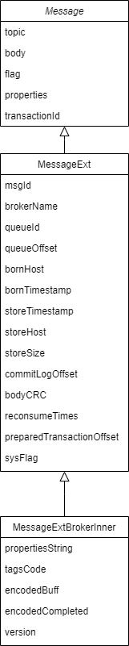
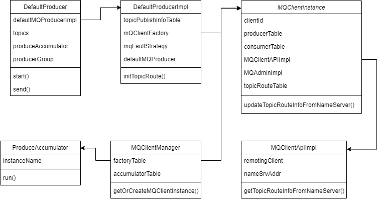

# 前言

本篇总结一条Remoting协议同步发送的普通消息从生产者客户端经网络传输到达Broker服务端并存储落盘的全过程。

按顺序涉及：Client、Remoting、Broker、Store 4个模块，这里会对各模块所涉及的部分做阅读总结。

# Message数据结构

# Client

#### 类关系

#### 生产者启动

DefaultMQProducer.start
- DefaultMQProducerImpl.start
  - MQClientManager.getInstance().getOrCreateMQClientInstance：MQClientInstance是客户端单例实例，由进程内所有Producer、Consumer共享，统一维护连接通道等资源。
  - MQClientInstance.registerProducer：按ProducerGroup将当前Producer反向注册至MQClientInstance，避免ProducerGroup重复。
  - MQClientInstance.start
    - MQClientAPIImpl.start：
      - RemotingClient.start：启动RemotingClient。
    - MQClientInstance.startScheduledTask：启动调整线程池、持久化消费offset、发送心跳、清理离线Broker、刷新路由信息、刷新namesrv地址等定时任务。
    - PullMessageService.start：启动消息拉取服务，用于消费场景。
    - RebalanceService.start：启动重平衡服务，用于消费场景。
    - DefaultMQProducerImpl.start：启动CLIENT_INNER_PRODUCER_GROUP生产者组的内部默认生产者，用于消息回发等场景。
  - MQFaultStrategy.startDetector
    - LatencyFaultTolerance.startDetector：启动Broker故障探测服务，帮助生产者屏蔽发送失败的Broker。
  - MQClientInstance.sendHeartbeatToAllBrokerWithLock：立即向所有Broker发送心跳包。
#### 路由获取

DefaultMQProducerImpl.initTopicRoute

- DefaultMQProducerImpl.tryToFindTopicPublishInfo
  - MQClientInstance.updateTopicRouteInfoFromNameServer
    - MQClientAPIImpl.getTopicRouteInfoFromNameServer：从NameSrv获取Topic路由数据。
    - MQClientInstance.topicRouteData2EndpointsForStaticTopic：将Topic路由数据转换成Endpoints供[静态Topic](https://github.com/apache/rocketmq/wiki/RIP-21-logical-queue-abstraction-for-static-topic-and-fast-scale-out)使用。
    - MQClientInstance.topicRouteData2TopicPublishInfo：将Topic路由数据转换成Topic发布信息供生产者使用。
    - MQClientInstance. topicRouteData2TopicSubscribeInfo：将Topic路由数据转换成Topic订阅信息供消费者使用。

#### 消息发送

DefaultMQProducer.send
- DefaultMQProducerImpl.sendDefaultImpl
  - DefaultMQProducerImpl.tryToFindTopicPublishInfo：尝试找到目标Topic的发布信息。
  - DefaultMQProducerImpl.selectOneMessageQueue：按故障容错策略挑选一个可用队列。
  - DefaultMQProducerImpl.sendKernelImpl：执行发送消息前的钩子函数，组装SendMessageRequestHeader。
    - MQClientAPIImpl.sendMessage：组装RemotingRequest。
      - MQClientAPIImpl.sendMessageSync：调用RemotingClient。
        - RemotingClient.invokeSync：发送Remoting请求。

#### 高可用

- 重试机制：生产者在消息发送时如果出现失败，默认会在发送超时时间范围内立即重试 2 次。
- 故障规避机制：如果重试的消息仍发往同一个 Broker，发送大概率还是会失败，所以在重试挑选队列时会尽量避开刚刚发送失败的 Broker。
  - 可以通过配置故障延迟机制来指定是在本次消息发送时暂时避开发送失败的 Broker，还是在之后一段时间都避开该 Broker

# Remoting

RemotingClient.invokeSync：具体网络传输放到Remoting框架解析再分析。

# Broker

SendMessageProcessor.processRequest：

- SendMessageProcessor.parseRequestHeader：
- SendMessageProcessor.executeSendMessageHookBefore：
- SendMessageProcessor.sendMessage：

# Store
具体消息落盘细节放到Store模块解析再分析。

