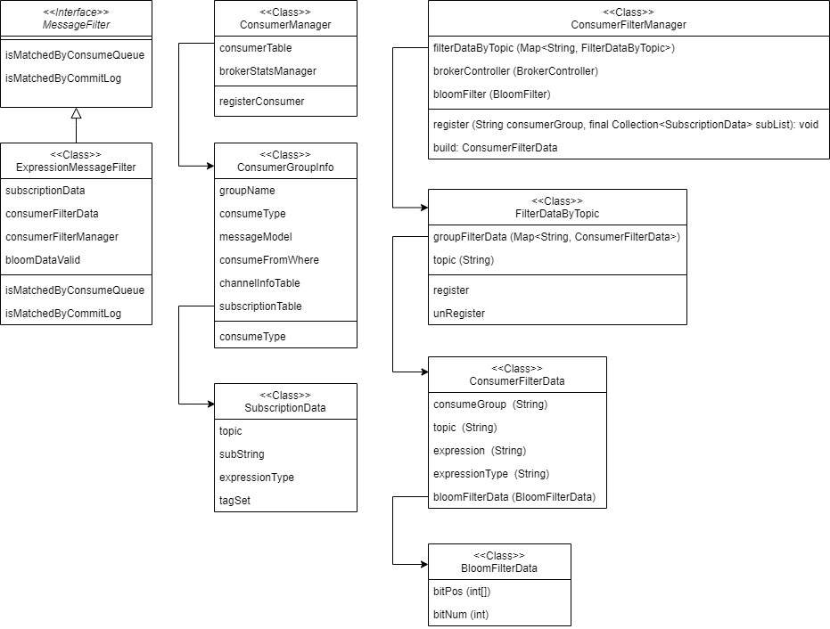

# 前言
本文总结高级特性“消费过滤”设计与实现，包括TAG、SQL92两种过滤方式。

# 订阅关系
首先回顾何为订阅关系：

RocketMQ中同一消费组下所有消费者对于指定Topic的订阅关系必须保持一致，其中包括：
- 订阅的Topic必须一致。
- 订阅多个Topic时Topic的类型一致。
- 订阅的同一个Topic中的Tag必须一致，包括Tag的数量和Tag的顺序。

其中第三点告诉了我们，指定Topic时同一个消费组中所有消费者的过滤条件都是相同的；订阅关系一致的情况下，确定了消费组 + Topic，等于确定了过滤条件。

# 设计
最简单直接的思路：
- 订阅关系更新时服务端更新保存订阅关系中的过滤条件。
- 消费者拉取消息时服务端按过滤条件返回满足条件的消息。

针对第二点RocketMQ做了改进，将整个过程分为了初筛、精筛两阶段，如初筛未通过则直接跳过，减少全量精筛带来的性能消耗。在TAG、SQL92两种方式上的具体体现：
- TAG：服务端只做ConsumeQueue中每条消息索引中TAG字符串哈希码的过滤，由于不同TAG的哈希码可能相同，所以即使过滤通过也只能表示该消息可能符合过滤条件，按TAG字符串逐字符匹配的精筛则放到消费者客户端拉取到消息后的结果处理方法中。
- SQL92：服务端首先基于ConsumeQueue中存储的每条消息的布隆过滤器判断当前消费者是否匹配过滤条件；由于布隆过滤器的算法必定存在误判率，所以无法完全确定匹配；如过滤通过再按SQL92表达式计算做精确匹配。

# 实现

### 类关系

### 过滤信息的注册
不管TAG还是SQL92所有过滤信息均通过消费者发送的心跳包触发注册及更新。

TAG信息注册实现在ConsumerManager类registerConsumer方法。

SQL92信息注册实现在ConsumerFilterManager类register方法。

### 过滤器接口
无论TAG、SQL92都依赖ExpressionMessageFilter类实现消息过滤。该类按照MessageFilter接口实现2个过滤方法：
- isMatchedByConsumeQueue: 队列粒度过滤，这里只会查询队列信息或消息索引，用于第一级初筛。
- isMatchedByCommitLog: 消息粒度过滤，这里会查询消息详情，用于第二级精筛。

### TAG实现
TAG过滤信息存储在SubscriptionData类中，包括过滤表达式以及过滤表达式的哈希码,涉及的相关类：
- ConsumerManager
- ConsumerGroupInfo
- SubscriptionData

### SQL92实现
SQL92过滤信息存储在ConsumerFilterManager类中，包括原始表达式以及经JavaCC编译后的表达式，涉及的相关类：
- ConsumerFilterManager
- FilterDataMapByTopic
- ConsumerFilterData
- BloomFilterData